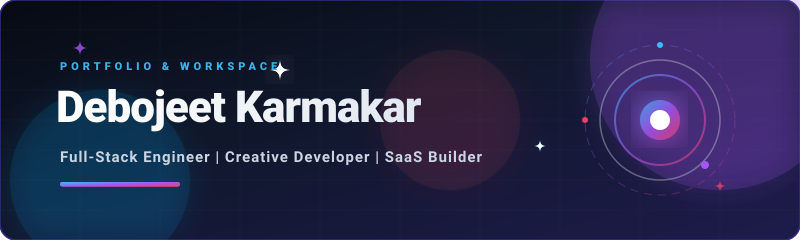

<!-- Vector Banner -->

 

### B.Tech Computer Science Graduate • Kolkata, India

🚀 **Building scalable SaaS, high-performance UI libraries, and AI integrations.**

---

---

> [!NOTE]
> **Current Focus**: Transitioning towards high-scale **Data Analytics** and cloud databases. Deepening my roadmap in **SQL querying, Power BI/Excel dash-building, and Microsoft Azure Cloud**.

---

## 🌟 About My Story

* 🎓 **Academic Base**: B.Tech in **Computer Science** from **JIS University**, Kolkata (Class of 2025). Previously schooled at **Shishu Vihar** (KG1 to Class 8) and **Kids Garden Senior Secondary School** (Class 11 & 12).
* 💼 **Professional Core**: 
  * **Fullstack Engineer at Prepverse** (Sept 2024 – Apr 2026): Co-directed full-stack system architecture, co-engineering and scaling the platform from **0 to 44,000+ active users**.
  * **Frontend Engineer at Training Mug** (June 2024 – Sept 2024): Designed and built responsive student career dashboard pathways.
* 📦 **Product Creator**: Founder of **[Devbuilds](https://devbuilds.in)**, a modular platform delivering rich animated UI templates and custom command-line utilities.

---

## 🛠️ The Technical Stack

<b>💻 Development Technologies</b>

| Field | Tools & Systems |
| :--- | :--- |
| **Frontend** | React, Next.js (App Router), TypeScript, TailwindCSS, HTML5/CSS3 |
| **Mobile** | React Native, Expo |
| **Backend & APIs** | Node.js, Express, WebSockets, REST APIs, Vercel AI SDK |
| **Databases & ORMs** | PostgreSQL, Neon, Drizzle ORM, Supabase, Firebase, pgvector |
| **Cloud & Infra** | Microsoft Azure, Docker, Vercel, Git/GitHub |
| **Design** | Figma, Tldraw, Notion |

---

## 🚀 Key Projects

### 🏥 [SafeHealth](https://github.com/debojeet-2004/safehealth)
> An AI-powered mobile prescription guide and medication scheduling system.
* **Stack**: React Native, Expo, Supabase PostgreSQL, Drizzle ORM, OpenAI APIs.
* **Features**: AI-powered prescription document extraction, offline storage caches, recurring alerts.

### 📦 [Devbuilds CLI Tool](https://github.com/Developers-stater-kit/CLI-TOOL)
> An interactive terminal engine for developers to ingest clean frontend blocks.
* **Stack**: Commander.js, Bun, Tailwind CSS, Radix UI presets.
* **Features**: Interactive terminal menus, zero-config configuration discovery, direct registry synchronization.

### 🤖 [ZenoAI](https://zenoai-rouge.vercel.app)
> Multi-tenant RAG SaaS enabling businesses to build context-aware chatbots.
* **Stack**: Next.js, PostgreSQL (pgvector), Gemini AI, Better Auth, Dodo Payments.
* **Features**: Document vector chunk ingestion, semantic similarity search engines, embeddable website widgets.

### 🦷 [Nirmal Dental Care](https://nirmaldentalclinic.vercel.app)
> A high-converting premium clinic experience landing page.
* **Stack**: Next.js, React Server Components (RSC), Tailwind CSS, Framer Motion.
* **Features**: Smooth spring animations, integrated doctor schedules, custom map layouts.

---

## ✍️ Published Blogs (Live on debojeet.in)

* 🛣️ **[My Journey Till Now](https://debojeet.in/blog/my-journey-till-now)**: Tracing my steps from schools in Dhanbad, through JIS University, to remote SaaS engineering and transition goals.
* 📊 **[Pivoting to Data Analytics](https://debojeet.in/blog/from-full-stack-to-data-analytics)**: Explaining my shift in interest from web layouts to database indexing, SQL pipelines, and cloud analytics.

---

## 📇 Connect With Me

* 📧 **Email**: [debojeetkarmakar2004@outlook.com](mailto:debojeetkarmakar2004@outlook.com)
* 📞 **Phone**: +91 9330455142
* 💼 **LinkedIn**: [Debojeet Karmakar](https://www.linkedin.com/in/debojeet-karmakar-852820210)
* 🐦 **X / Twitter**: [@debojeetbuilds](https://x.com/debojeetbuilds)

---

  Let's build clean, high-performance web systems and scale them together! Powered by Debojeet Karmakar.

